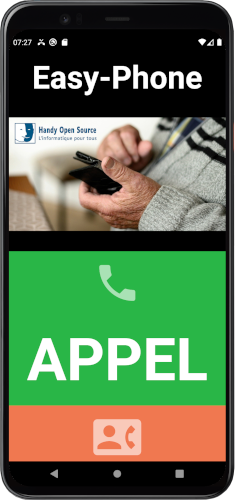
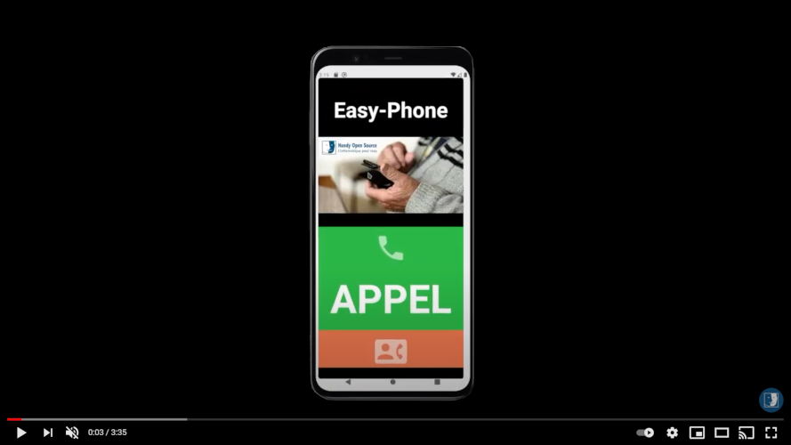

# **HOS_DVK Easy-Phone** #
  

  
## Une application Android Accessible ##

Vous êtes ou vous connaissez des personnes agées / malvoyantes / handicapées.   
  
Nous avons développé une application mobile, qui a peut vous intéresser.  
  
En effets, nous avons créer une application,
Sur laquel il n'y a que les fonctions de bases d'un téléphone : 
 * appel
 * contact
 * sms
 * photos
 * et la possibilité de retourner sur le launcher de base du téléphone.

Le code source est là : [Code Source](https://github.com/handyopensource/HOSDVK-EasyPhone)  
L'app est sous licence GPL : [LICENCE](LICENSE_GPL.md)